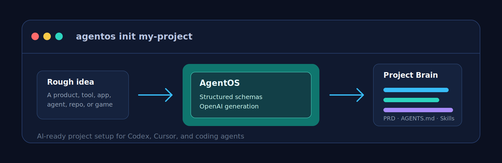

# AgentOS

<p align="center">
  
</p>

<p align="center">
  <a href="https://github.com/QuantumCoderSys/AgentOS/actions/workflows/ci.yml"></a>
  
  
  
</p>

AgentOS is an AI-powered project setup CLI for coding agents. It turns a rough idea into a version-controlled **Project Brain**: PRD, architecture plan, implementation roadmap, acceptance criteria, agent rules, risk register, security notes, and a project-specific Agent Skill.

It is built for Codex first, works well with Cursor, and stays portable for other agents that can read markdown instructions or Agent Skills.

## Why AgentOS exists

AI coding agents work better when the project has clear context before implementation starts. AgentOS gives every new repo the context agents usually miss:

- what the project is
- who it is for
- what the MVP includes
- what is explicitly out of scope
- what architecture and constraints matter
- how future agents should plan, code, test, and document changes
- where durable decisions are logged

AgentOS does **not** scaffold a full application. It prepares the repo so a coding agent can build with less ambiguity.

## Features

- **AI-generated project docs** using structured schemas, not static markdown templates
- **OpenAI provider support** with bring-your-own `OPENAI_API_KEY`
- **Mock provider fallback** so tests and dry runs can work without OpenAI
- **Project Brain generation** under `docs/agentos/`
- **Codex-ready `AGENTS.md`**
- **Cursor rules export** under `.cursor/rules/`
- **Project-specific Agent Skill** under `.agents/skills/project-context/`
- **Existing repo mode** with safe file scanning and secret redaction
- **Dry run and confirmation flow** before writing files
- **Doctor command** to validate generated outputs
- **Refinement flow** for evolving project decisions

## Install

From source:

```bash
git clone https://github.com/QuantumCoderSys/AgentOS.git
cd AgentOS
npm install
npm run build
npm link
```

After npm package publication:

```bash
npm install -g agentos
```

## Quick Start

```bash
export OPENAI_API_KEY=sk-...
agentos init my-project
```

AgentOS will ask a few project-shaping questions, generate a preview, and then write the Project Brain into the target directory after confirmation.

For a non-interactive run from a text file:

```bash
agentos init my-project --from idea.txt --yes
```

For a dry run:

```bash
agentos init my-project --from idea.txt --dry-run
```

## Existing Repo Mode

Run AgentOS inside an existing project:

```bash
cd existing-project
agentos init --existing
```

AgentOS scans safe project files such as `README.md`, `package.json`, and selected source files under `src/`, applies secret redaction, and uses that context to generate missing project docs and agent instructions.

## Generated Output

Default output:

```text
docs/agentos/
  PROJECT_BRIEF.md
  PRODUCT_REQUIREMENTS.md
  ARCHITECTURE.md
  IMPLEMENTATION_PLAN.md
  AGENT_WORKFLOW.md
  ACCEPTANCE_CRITERIA.md
  TECH_DECISIONS.md
  DESIGN_DIRECTION.md
  SECURITY_AND_PRIVACY.md
  RISK_REGISTER.md
  DECISIONS_LOG.md
  GLOSSARY.md

AGENTS.md

.agents/skills/project-context/
  SKILL.md
  references/
    project-summary.md
    implementation-plan.md
    validation-checklist.md

.cursor/rules/
  project-context.mdc

.agentos/
  config.json
  manifest.json
  run-history.jsonl
  redaction-report.json
  generated-by.md
```

## Commands

| Command | Description |
| --- | --- |
| `agentos init [directory]` | Create a new Project Brain |
| `agentos init --existing` | Generate context for an existing repo |
| `agentos brief --from idea.txt` | Generate docs from a rough text input |
| `agentos refine "changed constraint"` | Update generated docs from new constraints |
| `agentos export --target cursor` | Export target-specific agent files |
| `agentos export --all` | Export Codex, Cursor, and generic instructions |
| `agentos skill pack` | Generate a project-specific Agent Skill |
| `agentos skill pack --codex-plugin` | Generate a skill and Codex plugin wrapper |
| `agentos doctor` | Validate installation and generated outputs |
| `agentos config show` | Print resolved configuration |
| `agentos config set model gpt-5.5` | Persist local config override |
| `agentos provider test` | Validate AI provider connectivity |

## Using with Codex

AgentOS writes `AGENTS.md` at the project root. Codex reads this file before work, so future tasks inherit the generated read order, constraints, testing rules, and approval triggers.

You can also explicitly ask Codex:

```text
Use $project-context to understand this project before implementing anything.
```

## Using with Cursor

AgentOS writes Cursor-compatible rules:

```text
.cursor/rules/project-context.mdc
```

These rules point Cursor at the generated Project Brain and preserve the project constraints while coding.

## Configuration

Config sources:

- global: `~/.agentos/config.json`
- local: `.agentos/config.json`
- environment: `AGENTOS_MODEL`, `AGENTOS_PROVIDER`

Supported local config updates:

```bash
agentos config set provider openai
agentos config set model gpt-5.5
agentos config set outputDir docs/agentos
agentos config set targets codex,cursor,generic
agentos config set repoScan.enabled true
```

## Privacy and Security

AgentOS is designed around bring-your-own-key usage and local file ownership.

- API keys are read from environment variables.
- AgentOS never writes API keys to generated files.
- Existing-repo mode scans only selected safe files.
- Repository content is redacted before it is sent to the AI provider.
- Generated output is checked for obvious secrets before writing.
- `.agentos/redaction-report.json` records which scanned files required redaction.

## Architecture

AgentOS is a TypeScript CLI built around small modules:

```text
src/
  cli.ts
  commands/
  generation/
  provider/
  repo-inspector/
  exports/
  skill/
  validators/
  writers/
  utils/
```

Core flow:

1. Collect idea, answers, and optional repo summary.
2. Normalize intake into a structured project profile.
3. Generate a schema-controlled artifact plan.
4. Generate each document through the AI provider.
5. Review generated docs for consistency.
6. Detect secrets.
7. Preview and write files.
8. Persist manifest, config, run history, and redaction report.

## Development

```bash
npm install
npm run build
npm test
```

Run from source:

```bash
node dist/cli.js init ../sample-project --from idea.txt --yes
```

Use the mock provider path by leaving `OPENAI_API_KEY` unset:

```bash
unset OPENAI_API_KEY
node dist/cli.js init ../sample-project --from idea.txt --yes
```

## Quality Checks

Before opening a pull request:

```bash
npm run build
npm test
```

CI runs the same checks on Node.js 20 and 22.

## Project Principles

- Generate project-specific docs, not generic filler.
- Use structured schemas and runtime validation.
- Avoid local markdown templates for generated project docs.
- Keep API keys private.
- Show planned writes before modifying a repo unless `--yes` is passed.
- Log durable decisions in `docs/agentos/DECISIONS_LOG.md`.

## Roadmap

- Richer diff previews for `agentos refine`
- Additional provider adapters
- More target exports for agent ecosystems
- Optional repository inspection tools
- Stronger generated-doc quality checks
- npm release automation

## Contributing

Contributions are welcome. Read [CONTRIBUTING.md](./CONTRIBUTING.md), run the test suite, and keep changes aligned with [agentos_skill_prd.md](./agentos_skill_prd.md).

## Security

Please report security issues according to [SECURITY.md](./SECURITY.md). Do not open public issues containing secrets or exploit details.

## License

MIT. See [LICENSE](./LICENSE).
